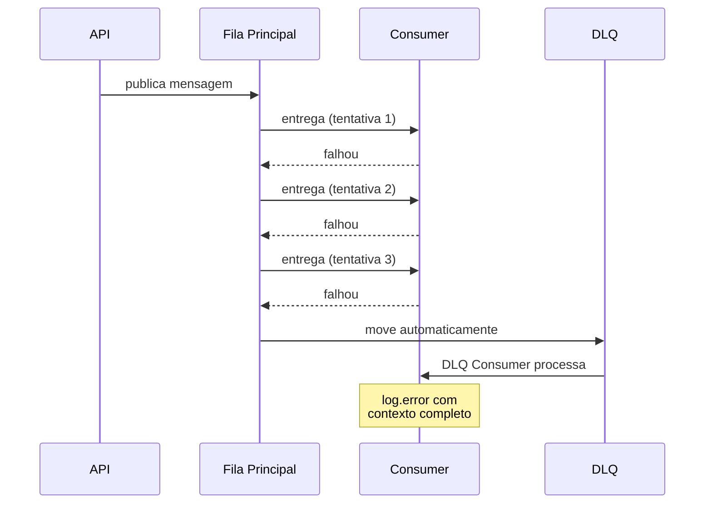
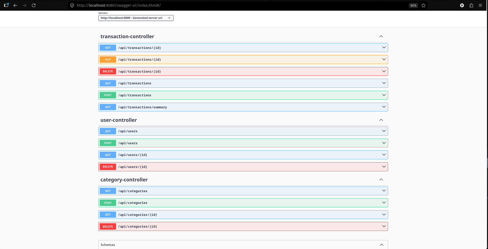
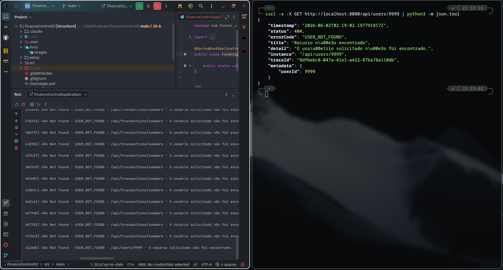
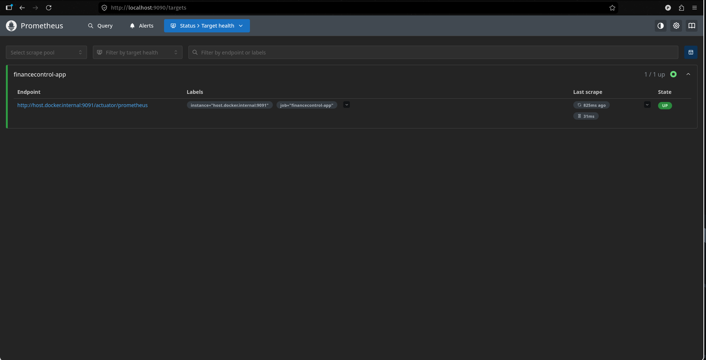
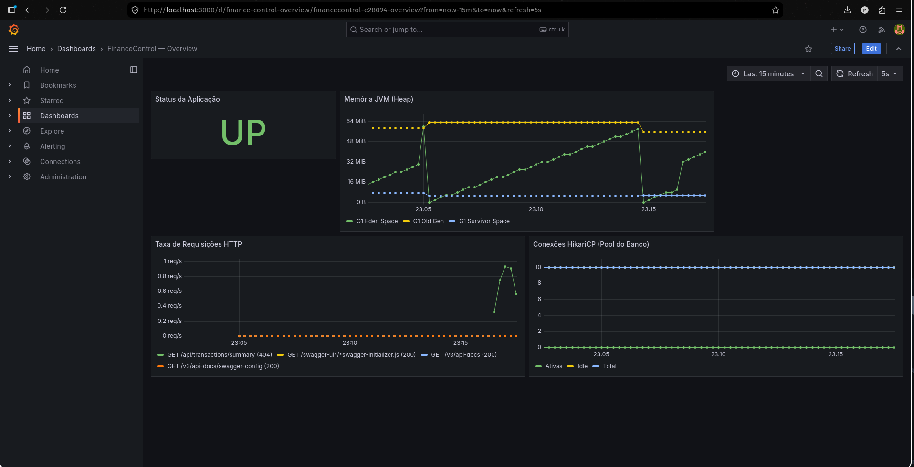

# FinanceControl V2

API REST de controle financeiro pessoal construída como laboratório de infraestrutura back-end. Partiu de um CRUD simples (V1) e ganhou cache distribuído, mensageria assíncrona com Dead Letter Queue, gestão de secrets, observabilidade e simulação completa de AWS — tudo rodando localmente via Docker Compose.

[](https://openjdk.org/projects/jdk/21/)
[](https://spring.io/projects/spring-boot)
[](https://www.postgresql.org/)
[](https://redis.io/)
[](https://www.localstack.cloud/)
[](https://prometheus.io/)
[](https://grafana.com/)
[](https://docs.docker.com/compose/)

---

## Sumário

- [O que esse projeto é (e o que não é)](#o-que-esse-projeto-é-e-o-que-não-é)
- [Arquitetura](#arquitetura)
- [Stack](#stack)
- [Como rodar](#como-rodar)
- [Estrutura do projeto](#estrutura-do-projeto)
- [Funcionalidades](#funcionalidades)
- [Endpoints](#endpoints)
- [Tratamento de erros](#tratamento-de-erros)
- [Observabilidade](#observabilidade)
- [Decisões técnicas](#decisões-técnicas)
- [Autor](#autor)

---

## O que esse projeto é (e o que não é)

**É** um projeto de aprendizado sério. A API em si (CRUD de usuários, categorias e transações) é simples de propósito — o que importa é a infraestrutura ao redor dela. Cada peça foi adicionada com objetivo de aprender um conceito específico: cache distribuído, mensageria assíncrona, isolamento de falhas, gestão de credenciais, observabilidade.

**Não é** um produto. Não tem autenticação, autorização, paginação avançada, multi-tenancy, ou as dezenas de coisas que um sistema financeiro real teria. É um laboratório.

A V1 era um CRUD Spring Boot + PostgreSQL local. A V2 adicionou tudo o resto.

---

## Arquitetura

```mermaid
graph TB
    Cliente[Cliente HTTP]

    subgraph Aplicacao["Aplicação Spring Boot"]
        Controllers[Controllers REST]
        Services[Services + Use Cases]
        Producers[SQS Producer]
        Consumers[SQS Consumers]
    end

    subgraph Infra["Infraestrutura - Docker Compose"]
        Postgres[(PostgreSQL)]
        Redis[(Redis Cache)]
        LocalStack[LocalStack<br/>SQS + Secrets Manager]
        Prometheus[Prometheus]
        Grafana[Grafana]
    end

    Cliente -->|HTTP/REST| Controllers
    Controllers --> Services
    Services -->|JPA| Postgres
    Services -->|@Cacheable| Redis
    Services --> Producers
    Producers -->|publica| LocalStack
    LocalStack -->|consome| Consumers

    Aplicacao -.->|/actuator/prometheus| Prometheus
    Grafana -->|consulta| Prometheus
    Services -.->|busca credenciais| LocalStack
```

A aplicação faz scrape de métricas no Actuator, que é coletado pelo Prometheus e visualizado no Grafana. Credenciais de banco vêm do Secrets Manager (LocalStack). Cada operação de escrita publica um evento no SQS, que é consumido em uma thread separada.

---

## Stack

| Camada | Tecnologia |
|--------|-----------|
| Linguagem | Java 21 |
| Framework | Spring Boot 3.5 |
| Persistência | PostgreSQL 16 + Hibernate/JPA |
| Cache | Redis 7 (Spring Cache + Lettuce) |
| Mensageria | AWS SQS (via LocalStack) — Spring Cloud AWS |
| Secrets | AWS Secrets Manager (via LocalStack) |
| Observabilidade | Prometheus + Grafana + Micrometer |
| Documentação | SpringDoc OpenAPI (Swagger) |
| Qualidade | Checkstyle + Prettier |
| Testes | JUnit 5 + Mockito + H2 (in-memory) |
| Containerização | Docker + Docker Compose |

---

## Como rodar

### Pré-requisitos

- Java 21
- Docker e Docker Compose
- Maven (ou usar o wrapper `./mvnw`)
- Make (opcional, mas recomendado)

### Passo a passo

**1. Clone o repositório**

```bash
https://github.com/pehenriqueoliv/FinanceControlV2.git
cd FinanceControlV2
```

**2. Suba a infraestrutura**

```bash
make up
```

Isso inicia 5 containers: PostgreSQL, Redis, LocalStack, Prometheus e Grafana. Na primeira execução, o LocalStack roda o `init.sh` que cria a fila SQS, a DLQ, a redrive policy e o secret de credenciais do banco.

**3. Rode a aplicação**

Pela IDE (IntelliJ recomendado): rode a classe `FinanceControlApplication` com a variável de ambiente `SPRING_PROFILES_ACTIVE=local`.

Ou pelo terminal:

```bash
SPRING_PROFILES_ACTIVE=local ./mvnw spring-boot:run
```

**4. Confirme que tudo está no ar**

| Serviço | URL |
|---------|-----|
| API | http://localhost:8080 |
| Swagger | http://localhost:8080/swagger-ui/index.html |
| Health | http://localhost:9091/actuator/health |
| Métricas Prometheus (raw) | http://localhost:9091/actuator/prometheus |
| Prometheus UI | http://localhost:9090 |
| Grafana | http://localhost:3000 (admin / admin) |

### Comandos do Makefile

```bash
make up        # sobe a infraestrutura
make stop      # para os containers (preserva volumes)
make destroy   # para e remove containers
make logs      # acompanha logs de todos os containers
make lint      # roda Checkstyle
make prettier  # formata o código
```

---

## Estrutura do projeto

```
financecontrolv2/
├── setup/                            # Tudo de infraestrutura
│   ├── docker-compose.yml
│   ├── .env
│   ├── db/dumps/                     # Scripts SQL de inicialização
│   ├── localstack/init/              # Script que provisiona SQS e secrets
│   └── observability/
│       ├── prometheus/prometheus.yml
│       └── grafana/provisioning/     # Datasource e dashboard automáticos
│
├── src/main/java/.../financecontrol/
│   ├── controller/                   # Endpoints REST
│   ├── service/                      # Lógica de negócio + cache
│   ├── repository/                   # Acesso a dados (JPA)
│   ├── entity/                       # Entidades JPA
│   ├── dto/                          # Request/Response DTOs
│   ├── mapper/                       # Conversão entity ↔ DTO
│   ├── messaging/                    # SQS producers e consumers
│   ├── config/                       # Configurações (Redis, etc.)
│   └── exception/                    # Hierarquia de erros + handler global
│       ├── core/                     # Base abstrata (DomainException)
│       ├── notfound/                 # 404
│       ├── business/                 # 422
│       ├── duplicate/                # 409
│       ├── response/                 # ProblemDetail (RFC 7807)
│       └── GlobalExceptionHandler.java
│
├── src/main/resources/
│   ├── application-local.yaml        # Perfil local (Secrets Manager + defaults)
│   ├── application-dev.yaml          # Perfil de container (sem defaults)
│   └── application-test.yml          # Perfil de teste (H2, infra mockada)
│
└── src/test/                         # Testes unitários (JUnit + Mockito)
```

---

## Funcionalidades

### CRUD com cache invalidado automaticamente

O endpoint `GET /api/transactions/summary?userId=X` calcula o balanço financeiro do usuário fazendo duas agregações no banco. Com `@Cacheable`, o resultado é armazenado no Redis por 5 minutos.

Quando uma transação é criada, atualizada ou deletada, o `@CacheEvict` invalida o cache automaticamente, garantindo que a próxima leitura busque dados atualizados.

```
1ª chamada: SELECT no banco + grava no Redis    →  ~50ms
2ª chamada: lê do Redis                          →  ~3ms
POST nova transação: invalida cache              →  CacheEvict
3ª chamada: SELECT no banco (dados atualizados)  →  ~50ms
```

### Mensageria assíncrona via SQS

Toda criação de transação publica uma mensagem em `transaction-notifications`. Um consumer escuta a fila em uma thread separada (não trava o request HTTP) e processa a notificação. Em produção real, isso poderia disparar envio de e-mail, push notification, ou alimentar um sistema de analytics.

### Dead Letter Queue para falhas tóxicas

Mensagens que falham 3 vezes no consumer principal são automaticamente movidas para `transaction-notifications-dlq`. Um consumer dedicado escuta essa DLQ e loga as mensagens em `ERROR`, sinalizando que aquele evento precisa de investigação humana — sem travar o processamento da fila principal.



### Credenciais via Secrets Manager

As credenciais do PostgreSQL não estão em texto plano no `.env`. Estão no Secrets Manager (LocalStack), e o Spring Cloud AWS as carrega na inicialização via `spring.config.import: aws-secretsmanager:finance-control/database`. O código Java é idêntico ao que rodaria em AWS real — só muda o endpoint.

---

## Endpoints

Documentação interativa completa em [`/swagger-ui/index.html`](http://localhost:8080/swagger-ui/index.html).



### Usuários

| Método | Rota | Descrição |
|--------|------|-----------|
| `POST` | `/api/users` | Cria usuário |
| `GET` | `/api/users` | Lista todos |
| `GET` | `/api/users/{id}` | Busca por ID |
| `DELETE` | `/api/users/{id}` | Remove usuário |

### Categorias

| Método | Rota | Descrição |
|--------|------|-----------|
| `POST` | `/api/categories` | Cria categoria |
| `GET` | `/api/categories` | Lista todas |
| `GET` | `/api/categories/{id}` | Busca por ID |
| `DELETE` | `/api/categories/{id}` | Remove categoria |

### Transações

| Método | Rota | Descrição |
|--------|------|-----------|
| `POST` | `/api/transactions` | Cria transação (publica evento SQS) |
| `GET` | `/api/transactions` | Lista com filtros e paginação |
| `GET` | `/api/transactions/{id}` | Busca por ID |
| `PUT` | `/api/transactions/{id}` | Atualiza |
| `DELETE` | `/api/transactions/{id}` | Remove |
| `GET` | `/api/transactions/summary` | Balanço financeiro (com cache) |

---

## Tratamento de erros

Todas as respostas de erro seguem um formato consistente baseado em [RFC 7807 (Problem Details for HTTP APIs)](https://www.rfc-editor.org/rfc/rfc7807). Cada erro inclui um `traceId` único (UUID) que aparece tanto no response quanto nos logs — facilita debug e suporte.



### Hierarquia de exceções

```
DomainException (abstract)
├── NotFoundException          → 404
│   ├── UserNotFoundException
│   ├── CategoryNotFoundException
│   └── TransactionNotFoundException
├── BusinessRuleException      → 422
│   ├── CategoryTypeMismatchException
│   └── InvalidTransactionAmountException
└── DuplicateResourceException → 409
    ├── DuplicateEmailException
    └── DuplicateCategoryException
```

### Códigos HTTP cobertos

| Status | Quando |
|--------|--------|
| `400` | JSON malformado, parâmetro ausente, tipo errado, validação `@Valid` falhou |
| `404` | Recurso não encontrado |
| `409` | Conflito por duplicidade (email já existe, categoria duplicada, violação de integridade) |
| `422` | Regra de negócio violada (ex: tipo de categoria incompatível com tipo de transação) |
| `500` | Erro inesperado — sempre logado em `ERROR` com stack trace completo e traceId |

### Logging

- Erros `4xx` (culpa do cliente): `WARN` sem stack trace, com traceId + path + errorCode
- Erros `5xx` (culpa nossa): `ERROR` com stack trace completo

---

## Observabilidade

### Prometheus

Faz scrape das métricas expostas pelo Actuator a cada 5 segundos. Inclui métricas da JVM (heap, threads, GC), do Tomcat (requests, latência), do HikariCP (pool de conexões), e qualquer métrica customizada.



### Grafana

Dashboard pré-provisionado com 4 painéis essenciais: status da aplicação, memória JVM heap, taxa de requisições HTTP e conexões do pool HikariCP. Atualiza a cada 5 segundos.



O dashboard é provisionado automaticamente via arquivo de configuração — não precisa criar nada manualmente.

---

## Decisões técnicas

Algumas escolhas que vale documentar:

**Por que `ddl-auto: validate` ao invés de `update`?**
Em produção, deixar o Hibernate alterar schema automaticamente é um risco. Validate força a estrutura do banco a ser criada por migrações explícitas (no caso, o `V_0_init.sql`). Mais previsível, mais auditável.

**Por que classes em vez de records para DTOs serializados?**
Records têm incompatibilidade conhecida com Jackson em alguns cenários de desserialização (cache do Redis, mensagens SQS). Para DTOs que vão pra cache distribuído ou fila, classes tradicionais com `@JsonCreator` são mais seguras. Para DTOs de request/response puros de HTTP, records funcionam bem.

**Por que LocalStack ao invés de mockar AWS?**
LocalStack emula a API real da AWS. O código Java que conversa com SQS, Secrets Manager e S3 é exatamente o mesmo que rodaria em produção — só muda a variável de ambiente do endpoint. Mockar perderia esse aprendizado.

**Por que perfis separados para `test`?**
Testes unitários não devem depender de infraestrutura externa. O perfil `test` usa H2 in-memory, desabilita auto-configuration do Redis reativo e mocka SQS/Secrets Manager. Roda em qualquer CI sem precisar de Docker.

**Por que `maxReceiveCount=3` na DLQ?**
Permite tolerância a falhas transitórias (banco lento, glitch de rede, API externa instável) sem mover mensagens válidas para a DLQ desnecessariamente. Três tentativas é um valor padrão razoável; em produção real, valeria ajustar baseado em métricas reais de erro.

---

## Autor

**Pedro Henrique** — [LinkedIn](https://www.linkedin.com/in/pehenriqueoliv)